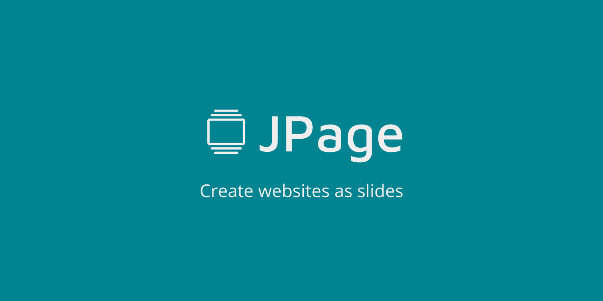

# JPage 😉 -   



JPage is a JavaScript plugin for creating websites in the form of slides.

## Get started
Import JPage JavaScript and CSS into your code. Then replace `{version}` with the desired version.

CSS:
```html
<link
  rel="stylesheet"
  href="https://cdn.jsdelivr.net/npm/jpage@{version}/lib/index.css"
/>
```

JavaScript:
```html
<script
  src="https://cdn.jsdelivr.net/npm/jpage@{version}/lib/index.js"
  type="module"
></script>
```
You can consult all versions of JPage by clicking [here](https://www.npmjs.com/package/jpage).

## Basic usege
With JPage you can create two types of pages: jpage-default and jpage-one-slider.

### jpage-default
```html
<div class="jpage">
  <div class="section" style="background-color: crimson;"> <!-- Your content --> </div>
  <div class="section">
    <div class="slider">
      <div class="slide" style="background-color: brown;"> <!-- Your content --> </div>
      <div class="slide" style="background-color: dimgray;"> <!-- Your content --> </div>
    </div>
  </div>
</div>

<script>
  const jpageConfig = {
    pageType: "jpage-default"
  }
</script>
```
Click [here](https://pedro-isacss.github.io/jpage/examples/jpage-default.html) to see an example.

### jpage-one-slider
```html
<div class="jpage">
  <div class="section">
    <div class="slider">
      <div class="slide" style="background-color: brown;"> <!-- Your content --> </div>
      <div class="slide" style="background-color: dimgray;"> <!-- Your content --> </div>
    </div>
  </div>
  <section> <!-- Your content --> </section>
</div>

<script>
  const jpageConfig = {
    pageType: "jpage-one-slider"
  }
</script>
```
Click [here](https://pedro-isacss.github.io/jpage/examples/jpage-one-slider.html) to see an example.

## Licence
JPage is [MIT licensed](https://github.com/pedro-isacss/jpage/blob/master/LICENSE).

## Author
Hi, my name is Pedro Isac.

[](https://mail.google.com/mail/u/0/?to=ss.pedroisac@gmail.com&tf=cm)
[](https://bit.ly/ss_pedroisac)
